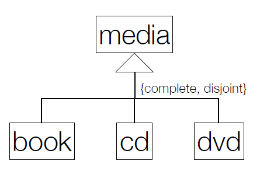
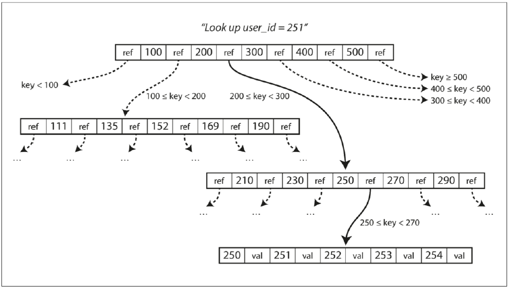
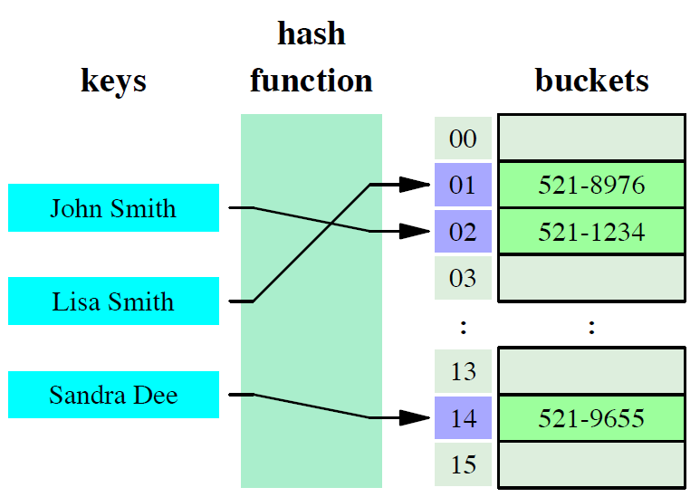

# Relational Schema 

## Composition
- attributes
- domains
- primary keys
- foreign keys

##  Integrity Rules
- UNIQUE
- DEFAULT
- NOT NULL
- CHECK

Se não estiver na Boyce–Codd Normal Form (BCNF), o esquema é refinado utilizando a normalização.

## Compact Notation
table1(<u>id</u>, attribute NN)

table2(<u>id</u>, attribute → Table1 NN)

table3(<u>id1, id2 → Table2</u>, attribute UK NN)

table4(<u>(id1, id2) → Table3</u>, id3, attribute)


NN -> NOTNULL, UK -> UNIQUE


## Aditional Domains

```
Today DATE DEFAULT CURRENT_DATE
Priority ENUM ('High', 'Medium', 'Low')
```

## Generalizations



media(<u>id</u>, ...)

book(<u>id->media</u>, ...)

cd(<u>id->media</u>, ...)

dvd(<u>id->media</u>, ...)


# Indexes in PostgreSQL
- Secondary data structures to improve data access

- `Without Indexing` => Tables are sequentially scanned 

- `With Indexing` => Number of steps to find the matching records table can be drastically reduced


## B-Tree Indexes 



## Hash Indexes



## Example
```sql
CREATE INDEX idx_numeric ON sample(x);
CREATE INDEX idx_numeric ON sample USING BTREE(x);
CREATE INDEX idx_numeric ON sample USING HASH(x);
DROP INDEX idx_numeric;
```
 
| **Query Type**                  | **Execution Plan**                                            | **Planning Time (ms)** | **Execution Time (ms)** |
|---------------------------------|--------------------------------------------------------------|------------------------|-------------------------|
| No Index                        | Gather (Parallel Seq Scan, Filter: x = '30')                | 49.868                | 9139.760               |
| Hash Index (Equality)           | Bitmap Heap Scan, Bitmap Index Scan (Index Cond: x = '30')  | 0.807                 | 0.031                  |
| Hash Index with Ordering        | Seq Scan, Filter: x > '30'                                  | 0.044                 | 1937.805               |
| B-Tree Index (Equality)         | Bitmap Heap Scan, Bitmap Index Scan (Index Cond: x = '30')  | 0.134                 | 0.028                  |
| B-Tree Index with Ordering      | Bitmap Heap Scan, Bitmap Index Scan (Index Cond: x > '30')  | 36.312                | 2029.121               |


| **Aspect**            | **B-Tree (Equality)**              | **B-Tree (With Ordering)**        |
|------------------------|-------------------------------------|------------------------------------|
| **Query Type**         | Exact matches (`=`)                | Range queries (`>`, `<`, etc.)     |
| **Index Usage**        | Direct lookup for single entries   | Scans a range of entries in the index |
| **Execution Speed**    | Faster (single entry retrieval)    | Slightly slower (retrieves a range of entries) |
| **Use Cases**          | Equality comparisons               | Range conditions and sorting       |

## Multicolumn

- Work when searching for **`both attributes simultaneously`** or **`just a`**. Not just b.


## Expression

- Indexes created on the result of an expression or function applied to column data.

### Example
```sql
SELECT * FROM test1 WHERE lower(col1) = 'value';
CREATE INDEX test1_lower_col1_idx ON test1 (lower(col1));
```

## Unique Indexes
- Ensures that column values (or combinations) are unique.

- Prevents duplicate entries in the indexed columns.
- Null values are not considered duplicates.

- **PostgreSQL automatically creates unique indexes for**:
    - Primary key constraints.
    - Explicit UNIQUE constraint

## Clustering
- A `one-time operation` to physically reorder table data based on an index.
 
- If needed, clustering can be set to run periodically using `cron`.

- Help when `multiple records are read together` and an `index can group them`

## Cardinality

`> Cardinality => < duplicate values in column`
- Evaluates the uniqueness of data values contained in a particular column

- Used to estimate the number
of rows returned by a `WHERE` clause. This is then used to decide if, and what, indexes should be used.
### Examples
- `High Cardinality => primary keys` (Apenas existe uma por linha, pelo que não se repete na coluna)

- `Medium cardinality - last name in a customer table`

- `Low cardinality - boolean column` (Apenas pode assumir `2 valores`, `True` ou `False`, pelo que a probabilidade de aparecer um valor boleano repetido numa coluna é bastante alta - Se houver no mínimo `3 linhas` de certeza aparece repetido um valor)

## Full Text Search (FTS)
