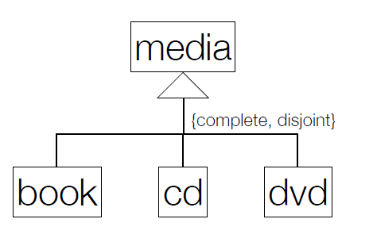
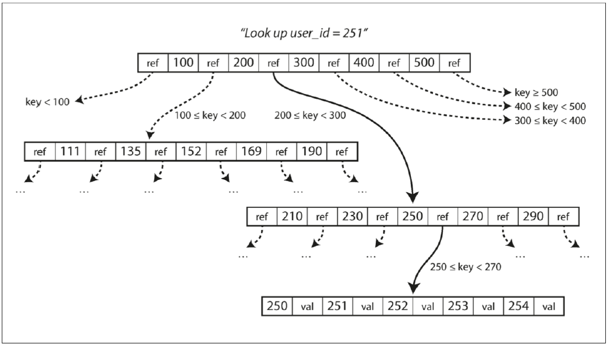
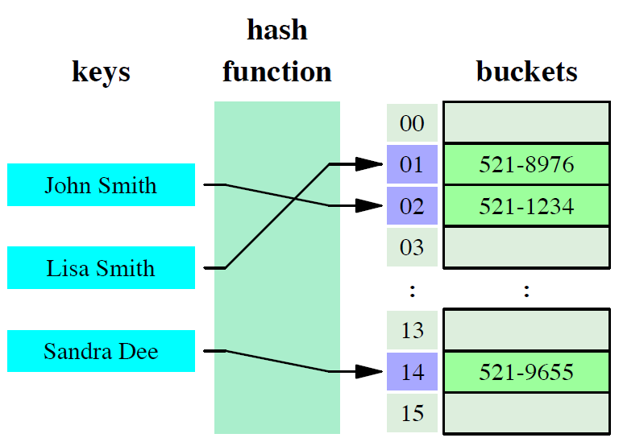
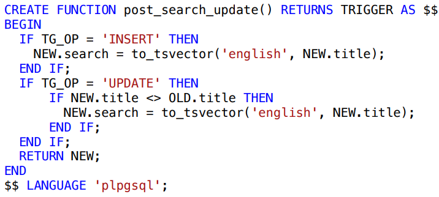

# Index
1. [Relational Schema](#relational-schema)
   - [Composition](#composition)
   - [Integrity Rules](#integrity-rules)
   - [Compact Notation](#compact-notation)
   - [Additional Domains](#additional-domains)
   - [Generalizations](#generalizations)

2. [Indexes in PostgreSQL](#indexes-in-postgresql)
   - [Overview](#overview)
   - [B-Tree Indexes](#b-tree-indexes)
   - [Hash Indexes](#hash-indexes)
   - [Example](#example)
   - [Comparison Table](#comparison-table)

3. [Advanced Index Types](#advanced-index-types)
   - [Multicolumn Indexes](#multicolumn-indexes)
   - [Expression Indexes](#expression-indexes)
   - [Unique Indexes](#unique-indexes)
   - [Clustering](#clustering)
   - [Cardinality](#cardinality)

4. [Full-Text Search (FTS)](#full-text-search-fts)
   - [Overview](#fts-overview)
   - [Key Components](#key-components)
     - [`tsvector` Type](#tsvector-type)
     - [`tsquery` Type](#tsquery-type)
     - [Matching](#matching)
   - [Weighting in FTS](#weighting-in-fts)
   - [Ranking FTS Results](#ranking-fts-results)
   - [Pre-Calculated FTS](#pre-calculated-fts)
   - [Indexing FTS](#indexing-fts)
     - 

# Relational Schema 

## Composition
- attributes
- domains
- primary keys
- foreign keys

##  Integrity Rules
- UNIQUE
- DEFAULT
- NOT NULL
- CHECK

Se não estiver na Boyce–Codd Normal Form (BCNF), o esquema é refinado utilizando a normalização.

## Compact Notation

table1(<ins>id</ins>, attribute NN)

table2(<ins>id</ins>, attribute → Table1 NN)

table3(<ins>id1, id2 → Table2</ins>, attribute UK NN)

table4(<ins>(id1, id2) → Table3</ins>, id3, attribute)


NN -> NOTNULL, UK -> UNIQUE


## Aditional Domains

```
Today DATE DEFAULT CURRENT_DATE
Priority ENUM ('High', 'Medium', 'Low')
```

## Generalizations



media(<ins>id</ins>, ...)

book(<ins>id->media</ins>, ...)

cd(<ins>id->media</ins>, ...)

dvd(<ins>id->media</ins>, ...)


# Indexes in PostgreSQL
- Secondary data structures to improve data access

- `Without Indexing` => Tables are sequentially scanned 

- `With Indexing` => Number of steps to find the matching records table can be drastically reduced


## B-Tree Indexes 



## Hash Indexes



## Example
```sql
CREATE INDEX idx_numeric ON sample(x);
CREATE INDEX idx_numeric ON sample USING BTREE(x);
CREATE INDEX idx_numeric ON sample USING HASH(x);
DROP INDEX idx_numeric;
```
 
| **Query Type**                  | **Execution Plan**                                            | **Planning Time (ms)** | **Execution Time (ms)** |
|---------------------------------|--------------------------------------------------------------|------------------------|-------------------------|
| No Index                        | Gather (Parallel Seq Scan, Filter: x = '30')                | 49.868                | 9139.760               |
| Hash Index (Equality)           | Bitmap Heap Scan, Bitmap Index Scan (Index Cond: x = '30')  | 0.807                 | 0.031                  |
| Hash Index with Ordering        | Seq Scan, Filter: x > '30'                                  | 0.044                 | 1937.805               |
| B-Tree Index (Equality)         | Bitmap Heap Scan, Bitmap Index Scan (Index Cond: x = '30')  | 0.134                 | 0.028                  |
| B-Tree Index with Ordering      | Bitmap Heap Scan, Bitmap Index Scan (Index Cond: x > '30')  | 36.312                | 2029.121               |


| **Aspect**            | **B-Tree (Equality)**              | **B-Tree (With Ordering)**        |
|------------------------|-------------------------------------|------------------------------------|
| **Query Type**         | Exact matches (`=`)                | Range queries (`>`, `<`, etc.)     |
| **Index Usage**        | Direct lookup for single entries   | Scans a range of entries in the index |
| **Execution Speed**    | Faster (single entry retrieval)    | Slightly slower (retrieves a range of entries) |
| **Use Cases**          | Equality comparisons               | Range conditions and sorting       |

## Multicolumn

- Work when searching for **`both attributes simultaneously`** or **`just a`**. Not just b.


## Expression

- Indexes created on the result of an expression or function applied to column data.

### Example
```sql
SELECT * FROM test1 WHERE lower(col1) = 'value';
CREATE INDEX test1_lower_col1_idx ON test1 (lower(col1));
```

## Unique Indexes
- Ensures that column values (or combinations) are unique.

- Prevents duplicate entries in the indexed columns.
- Null values are not considered duplicates.

- **PostgreSQL automatically creates unique indexes for**:
    - Primary key constraints.
    - Explicit UNIQUE constraint

## Clustering
- A `one-time operation` to physically reorder table data based on an index.
 
- If needed, clustering can be set to run periodically using `cron`.

- Help when `multiple records are read together` and an `index can group them`

## Cardinality

`> Cardinality => < duplicate values in column`
- Evaluates the uniqueness of data values contained in a particular column

- Used to estimate the number
of rows returned by a `WHERE` clause. This is then used to decide if, and what, indexes should be used.
### Examples
- `High Cardinality => primary keys` (Apenas existe uma por linha, pelo que não se repete na coluna)

- `Medium cardinality - last name in a customer table`

- `Low cardinality - boolean column` (Apenas pode assumir `2 valores`, `True` ou `False`, pelo que a probabilidade de aparecer um valor boleano repetido numa coluna é bastante alta - Se houver no mínimo `3 linhas` de certeza aparece repetido um valor)


## Full-Text Search (FTS)
- **Definition**: Provides efficient searching for textual data, supporting features like ranking, stemming, and proximity.

### Limitations of `LIKE`:
- Lacks linguistic support (e.g., handling singular/plural forms).
- Does not rank results or support complex queries.

### Steps:
1. **Define a Document**: Identify the columns and data that constitute searchable content.
2. **Index Words Individually**: Using PostgreSQL's FTS tools.

---

### Key Components of FTS

#### `tsvector` Type
- **Definition**: Stores lexemes (normalized words).
- **Features**:
  - Removes duplicates and stop words (e.g., "the", "and").
  - Records word positions.
- **Example**:
  ```sql
  SELECT to_tsvector('english', 'The quick brown fox jumps over the lazy dog');
  -- Result: 'brown':3 'dog':9 'fox':4 'jump':5 'lazi':8 'quick':2

#### `tsquery` Type
- **Definition**: Represents search queries optimized for matching `tsvector`.
- **Features**:
  - Created using functions like `plainto_tsquery` and `to_tsquery`.
- **Example**:
  ```sql
    SELECT plainto_tsquery('english', 'sail boats');
    -- Result: 'sail' & 'boat'

#### Matching
- **Definition**: Use the `@@` operator to match `tsvector` against `tsquery`.

- **Examples**:
   
    1. `Selecting`:
        ```sql
            SELECT * FROM posts WHERE to_tsvector('english', title) @@ plainto_tsquery('english', 'jumping dog');
        ```
    2. `Check`:
        ```sql
        ➔ SELECT to_tsvector('portuguese','o velho barco') @@
        plainto_tsquery('portuguese','barca');
        ➔ t
        ➔ SELECT to_tsvector('portuguese','o velho barco') @@
        plainto_tsquery('portuguese','carro');
        ➔ f
        ```

    


### Weighting in FTS

- Assigns importance to different parts of a document.

- **Weights**:
    - `A`: **Highest importance**.
    - `D`: **Lowest importance**.

- **Example:**
    1. `Format Example`:
        ```sql
        SELECT setweight(to_tsvector('english', 'Important text'), 'A') ||
            setweight(to_tsvector('english', 'Less important text'), 'D');
    2. `Example`:
        ```sql
        ➔ SELECT
        setweight(to_tsvector('english', 'The quick brown fox jumps over the lazy dog'), 'A') ||
        setweight(to_tsvector('english', 'An English language pangram. A sentence that contains
        all of the letters of the alphabet.'), 'B')
        ➔ 'alphabet':24B 'brown':3A 'contain':17B 'dog':9A 'english':11B 'fox':4A 'jump':5A
        'languag':12B 'lazi':8A 'letter':21B 'pangram':13B' quick':2A 'sentenc':15B
        ```

### Ranking FTS Results

- Orders search results by relevance.

- **Functions**:
    - `ts_rank`: Computes a ranking score based on `term frequency`, `proximity`, and `structural importance`.

- **Example:**
    1. `Format Example`:
        ```sql
        SELECT ts_rank(setweight(to_tsvector('english', 'content'), 'A'), plainto_tsquery('english', 'search terms'));
        ```
    2. `Example`:
        ```sql
        ➔ SELECT ts_rank(
        setweight(to_tsvector('english', 'The quick brown fox jumps over the lazy dog'), 'A') ||
        setweight(to_tsvector('english', 'An English language pangram. A sentence that contains all of the
        letters of the alphabet.'), 'B'),
        plainto_tsquery('english', 'jumping dog')
        )
        ➔ 0.9524299 
        ```

### Pre-calculated FTS
- **Optimization**:
    - Pre-calculate and store tsvector values in a table column.
    - Update this column using triggers when rows are inserted or updated.

- **Trigger to update the table**:

    

### Indexing FTS
- Search is a pre-calculated column containing the tsvector of the columns we want to search.
- Pre-calculating tsvector values and storing them in a column ensures better performance.
- Use the `@@` operator to match a `tsquery` against the `tsvector`.
- Use `ts_rank` to rank the results by relevance and order them.

**Example Query**   
- To select all posts containing both `jumping` and `dog`, use the following query:

```sql
SELECT title 
FROM posts
WHERE search @@ plainto_tsquery('english', 'jumping dog')
ORDER BY ts_rank(search, plainto_tsquery('english', 'jumping dog')) DESC;
```

**Creating Indexes**
1. `GIN` Index (Static Data)
    - `Faster` lookups for `larger datasets`

2. `GiST` Index (Dynamic Data - Frequent updates)
    - More `efficient` for `insertions` and `updates`

