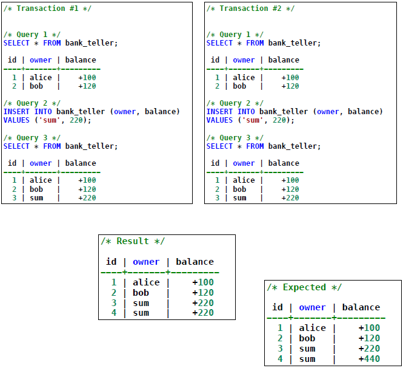

# Index

1. [User-Defined Functions (UDF)](#user-defined-functions-udf)
   - [Performance](#performance)
   - [Reusability](#reusability)
   - [Custom Logic](#custom-logic)
   - [Integration](#integration)
   - [Example](#example)

2. [Triggers](#triggers)
   - [Definition](#definition)
   - [Components](#components)
   - [Execution Modes](#execution-modes)
   - [Action Details](#action-details)

3. [ACID Properties](#acid-properties)
   - [Atomicity](#atomicity)
   - [Consistency](#consistency)
   - [Isolation](#isolation)
   - [Durability](#durability)

4. [Transactions](#transactions)
   - [Definition](#definition)
   - [Features](#features)
   - [Concurrency Problems](#concurrency-problems)
     - [Dirty Reads](#dirty-reads)
     - [Non-Repeatable Reads](#non-repeatable-reads)
     - [Phantom Reads](#phantom-reads)
     - [Serialization Anomaly](#serialization-anomaly)
   - [Solutions to Concurrency Problems](#solutions-to-concurrency-problems)
   - [Transaction Isolation Levels](#transaction-isolation-levels)

# UDF (User-Defined Functions)
**Performance:**
- Reduces the number of round trips between the application and the database.
- Efficient for computations performed on the database side.

**Reusability:**
- Once created, functions can be reused in queries and other functions.

**Custom Logic:**
- Encapsulates domain-specific logic within the database.

**Integration:**
- Can work with triggers, indexes, and constraints for enhanced control.

- Support for Multiple Languages: PostgreSQL supports PL/pgSQL, PL/Python, PL/Perl, and more.

**Example**

# Triggers
- Triggers are event-condition-action rules:
    - `Event`, a change to the database that activates the trigger
    - `Condition`, a query or test that is run when the trigger is activated
    - `Action`, a procedure that is executed when the trigger is activated and its condition is true
- The action can be executed before, after or instead of the trigger event
- The action may refer the new values and old values of records inserted, updated or deleted in the trigger event
- The programmer specifies that the action is performed:
    - once for each modified record (FOR EACH ROW)
    - once for all records that are changed on a database operation

## ACID Properties
- **Atomicity** guarantees that multiple operations are treated as an indivisible unit.

- **Consistency** guarantees that the database moves from one consistent state into
another consistent state (clients must ensure the application logic follows the
domain rules, being the primary responsible for the consistency of the system).

- **Isolation** guarantees that the outcome of multiple transactions executed
concurrently is the same as if every transaction was executed in isolation.

- **Durability** refers to the fact that the effects of a committed transaction should be
persisted into the database.

# Transactions
- `All-or-nothing` operation
- Ensures data **integrity**

- Set of database operations that is considered as a single unit

- `Succeeds` or `fails` 

## Database Management System

### Concurrency Problems

- **Dirty Reads:**
    - A transaction reads uncommitted data from another transaction.
    - Example: Transaction 1 reads data that Transaction 2 later rolls back.

        
    
- **Non-Repeatable Reads:**
    - A transaction reads the same data twice, but another transaction modifies the data in the interim, resulting in inconsistent results.

        

- **Phantom Reads:**
    - A transaction re-executes a query and sees new rows inserted by another transaction.

        

- **Serialization Anomaly:**
    - The final database state is inconsistent when transactions are executed concurrently.

        

| **Problem**            | **Description**                                                                                       | **Example**                                                                                                                                                          | **Solution**                                                                                 |
|-------------------------|-------------------------------------------------------------------------------------------------------|----------------------------------------------------------------------------------------------------------------------------------------------------------------------|---------------------------------------------------------------------------------------------|
| **Dirty Reads**         | A transaction reads uncommitted data from another transaction.                                       | Transaction 1 reads data updated by Transaction 2, but Transaction 2 rolls back, leaving Transaction 1 with incorrect data.                                         | Use higher isolation levels like **Read Committed**, **Repeatable Read**, or **Serializable**. |
| **Non-Repeatable Reads**| A transaction reads the same data twice but gets different results because another transaction modified it. | Transaction 1 reads a row, Transaction 2 updates that row, and Transaction 1 reads the row again, seeing the updated value.                                         | Use **Repeatable Read** or **Serializable** isolation levels.                               |
| **Phantom Reads**       | A transaction re-executes a query and sees new rows added by another transaction.                    | Transaction 1 selects rows matching a condition, Transaction 2 inserts a new row matching the condition, and Transaction 1 re-executes the query, seeing new rows. | Use **Serializable** isolation level to prevent phantoms.                                   |
| **Serialization Anomaly**| The outcome of transactions is inconsistent with any sequential execution of those transactions.      | Transactions modifying the same data lead to an invalid state, e.g., two transactions simultaneously deducting from the same account, resulting in incorrect totals. | Use the **Serializable** isolation level to ensure transactions execute as if sequentially.  |

## Transaction Isolation Levels 

| **Isolation Level**     | **Description**                                                                 | **Concurrency**         | **Consistency**             | **Common Use Cases**                              |
|--------------------------|---------------------------------------------------------------------------------|--------------------------|-----------------------------|--------------------------------------------------|
| **Read Uncommitted**     | Transactions can read uncommitted changes. Typically not fully supported in PostgreSQL (treated as Read Committed). | Very High               | Very Weak                  | Rarely used; suitable for analytics on temporary data. |
| **Read Committed**       | Transactions only see data committed at the moment of query execution.          | Moderate                | Medium                      | Default level; general-purpose usage.            |
| **Repeatable Read**      | Transactions only see data committed before the transaction began. No changes during execution are visible. | Low                     | High                        | Ensuring consistent reads for reports or batch processes. |
| **Serializable**         | Transactions are fully isolated and executed as if they were run sequentially.  | Very Low                | Very High                   | Critical operations, such as financial transactions. |
