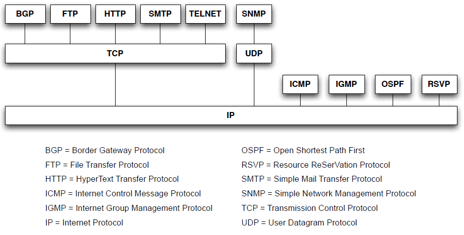
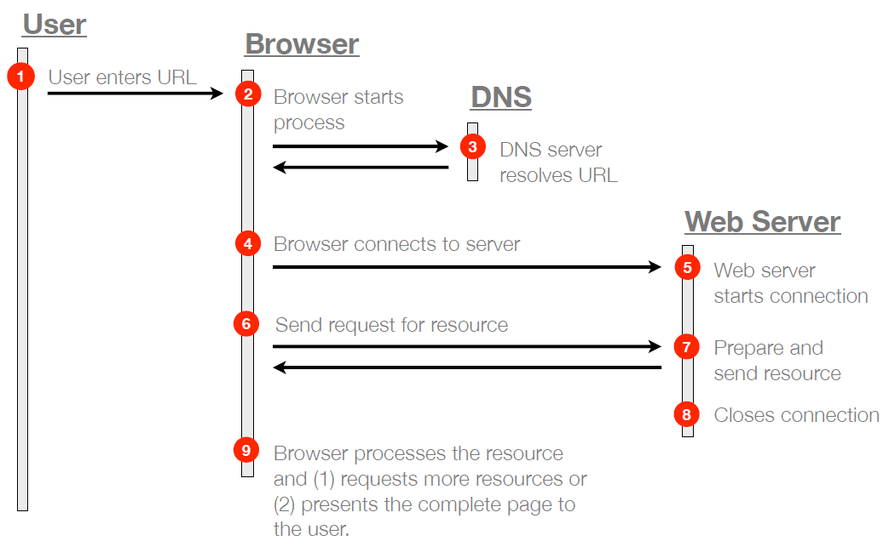

# Index

# The Internet - Introduction

## Internet Protocols

### Internet Protocol (**IP**)
- Main function is to offer a virtual network hiding the underlying physical networks
- Addressing system (`IP addresses`)
- Datagram structure (`packets`)

### Transmission Control Protocol (**TCP**)
- Offers a `reliable` and `ordered` delivery of packets
between applications in different computers

- Handles problems not addressed in the **lower layers**:
    - packet `duplication` and `loss`
    - packer `ordering` 
    - communication `delays`
-----

# Internet Services

- `DNS` — *Maps **IP** addresses to **symbolic names***
- `SMTP` — Handles **electronic messages** (e-mail)
- `SFTP` — Offers a mechanism for **secure file transfers** between computers
- `WWW (HTTP)` — A *hypertext-based* distributed information system.

## Domain Name System (**DNS**)
- In application layer
- Translates **human-readable** symbolic names to numeric addresses (**IP**)
- Organized hierarchically:
    - `Top-level domain => Right-Most element`
- TLD (Top Level Domains):
    - Country: `.pt`, `.es`, `.uk`, ...
    - General: `.com`, `.net`, `.org`, ...

## WHOIS Protocol

- `Query/response` protocol used to query databases that contain information about **internet resources**

- Human-readable format

# The World Wide Web (**WWW**)

- `Servers` are machines that are running server applications waiting for requests from clients. Each server can simultaneously serve multiple clients.

- `Clients` are typically web browsers that initiate the communication session with servers. Interactions are simple, one request results in one response.

# Client Server Interaction

## WWW's Core Technologies

`URL`: Uniform Resource Locator
- Used to identify the resources available on the web.

`HTTP`: HyperText Transfer Protocol
- Used to specify how clients communicate with servers.

`HTML`: HyperText Markup Language
- Used to represent and interlink documents on the web.

## `URL`: Uniform Resource Locator
- Unique address for WWW resource

- protocol://machine:port/directory/file.type

## `HTTP`: HyperText Transfer Protocol
- **Request-Response** Protocol
- `Timeouts`: server takes too long
- Stateless: 
    - `Request => Independent Transaction`
    - Simpler Design
    - Additional info in each request

### Request Methods

| **Método HTTP** | **Descrição**                                            | **Características Principais** |
|------------------|----------------------------------------------------------|---------------------------------|
| **GET**          | Solicita o recurso do servidor.                          | Operação idempotente.           |
| **HEAD**         | Solicita apenas os cabeçalhos (sem o conteúdo).          | Similar ao GET, mas sem corpo.  |
| **POST**         | Envia dados para serem processados no recurso identificado. | Não é idempotente.              |
| **PUT**          | Carrega dados no recurso especificado.                   | Operação idempotente.           |
| **DELETE**       | Exclui o recurso especificado.                           | Operação idempotente.           |

### Status Codes

| **Classe de Código** | **Descrição**                                        | **Exemplos**                     |
|-----------------------|-----------------------------------------------------|-----------------------------------|
| **1xx**              | Informacional                                       | -                                |
| **2xx**              | Sucesso                                            | `200 OK`, `201 Created`          |
| **3xx**              | Redirecionamento                                   | `301 Moved Permanently`          |
| **4xx**              | Erro do Cliente                                    | `404 Not Found`, `403 Forbidden` |
| **5xx**              | Erro do Servidor                                   | `500 Internal Server Error`      |

